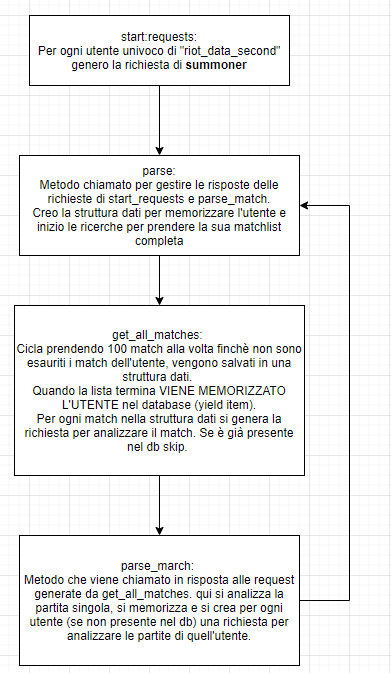

# TrafficMatchAnalysis
Little project to undestand Riot Api and collect data about players, i would check the distribution of player during the day to identify the avg traffic. 
I need to catch data (full anonymized) about duration and time of the day, then draw graph about elaborated data. 
The data will be stored in my pc and shared with at least my professor (btw i think only the results will be shared).

The API used are:
* match: to collect timestamp and duration
* summoner: to label some statistics (like "how many match a challenger usually play? And players between 1-30?")

___
## RUN

`scrapy activate riot_py38`

`export RIOT_KEY=...` <-- RICORDALO.

`scrapy crawl riot -s JOBDIR=crawls/<nome-job-dir> -a riot_key=$RIOT_KEY -a port=27017 -a db_name="riots_data_second"`

> in caso di interruzione `ctrl+c` e attendere fino a che non si è fermato e il terminale non restituisce il controllo

> per riprendendere l'esecuzione usare esattamente il comando di start

### Argomenti crawler
> precedere gli arg con `-a <nome arg>=<valore arg>` 

* riot_key = chiave per accedere alle api di TrafficMatch
* port = porta di mongo db a cui accedere
* db_name = nome del db a cui aggiungere i dati
___

## ULTERIORI COMANDI: 
--logfile FILE_NAME: Overrides LOG_FILE=FILE_NAME

--loglevel/-L LEVEL: Overrides LOG_LEVEL

--nolog: Sets LOG_ENABLED to False

-a: aggiunge gli argomenti 
port = porta per mongodb
user = utente da cui iniziare il crawl
riot_key = key per usare le api 

___
## Schema
